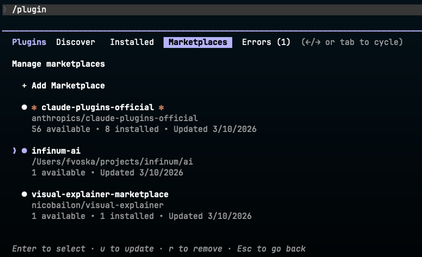
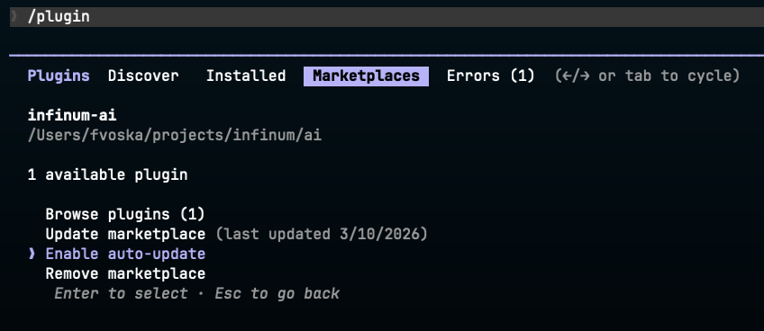

# Skills Marketplace

_Per-repo installable plugins for the Infinum AI Harness._

Skills are slash commands you invoke directly in your AI tool — they carry structured prompts, domain knowledge, and step-by-step procedures so you don't have to write them from scratch each time. Each skill ships as its own plugin so you install only what the project needs.

---

## Essentials (auto-installed)

The setup script enables these baseline plugins for everyone — they ship cross-cutting plumbing rather than user-invocable skills.

| Plugin                                                                          | What it does                                                                                                                                                                                                            | Cowork                                                  |
| ------------------------------------------------------------------------------- | ----------------------------------------------------------------------------------------------------------------------------------------------------------------------------------------------------------------------- | ------------------------------------------------------- |
| [`stack-essentials`](plugins/stack-essentials/)                                 | SessionStart hook that prints a one-line banner when `infinum/ai` has new commits on `main` since your last installer run. One `git ls-remote` per machine per 24h (uses your existing git credentials), silent on failure. Disable with `INFINUM_STACK_SKIP_UPDATE_CHECK=1` or `/plugin disable stack-essentials`. | Untested — SessionStart hooks may not fire under Cowork |

---

## Skills

| Skill                                                                                              | Description                                                                                                                                                                                                     | Cowork                                                                                    | Install                                                |
| -------------------------------------------------------------------------------------------------- | --------------------------------------------------------------------------------------------------------------------------------------------------------------------------------------------------------------- | ----------------------------------------------------------------------------------------- | ------------------------------------------------------ |
| [`create-prd`](plugins/create-prd/skills/create-prd/)                                              | Generate a Product Requirements Document (PRD) in Markdown. Guided flow with clarifying questions, structured output, and iterative refinement.                                                                 | Ready                                                                                     | `/plugin install create-prd@infinum-ai`                |
| [`claude-setup-audit`](plugins/claude-setup-audit/skills/claude-setup-audit/)                      | Audit your Claude Code installation for vulnerabilities, malicious code, prompt injection, and security issues across all extensibility points.                                                                 | Not ready — reads `~/.claude/` outside the workspace mount                                | `/plugin install claude-setup-audit@infinum-ai`        |
| [`ui-validation`](plugins/ui-validation/skills/ui-validation/)                                     | Validate UI against a Figma design using snapshot tests and a multimodal visual comparison. Framework-agnostic loop: implement with shared components → snapshot → fetch Figma → compare → fix or STOP-and-ask. | Not ready — runs the project's snapshot tests in the user's local dev environment         | `/plugin install ui-validation@infinum-ai`             |
| [`pr-review-code-simplicity`](plugins/pr-review-code-simplicity/skills/pr-review-code-simplicity/) | Review pull requests through the six laws of software design from "Code Simplicity" by Max Kanat-Alexander. Structured findings focused on long-term maintenance cost, not style.                               | Ready                                                                                     | `/plugin install pr-review-code-simplicity@infinum-ai` |
| [`download-figma-screenshot`](plugins/download-figma-screenshot/skills/download-figma-screenshot/) | Download Figma frame screenshots to disk as PNG files. Works via local MCP server or Figma REST API.                                                                                                            | Not ready — hits `localhost:3845` and `api.figma.com`, both unreachable from the sandbox  | `/plugin install download-figma-screenshot@infinum-ai` |
| [`package-security-check`](plugins/package-security-check/skills/package-security-check/)          | Comprehensive security audit of a package before updating it. Layered checks across GitHub source, registry metadata, install scripts, known CVEs, maintainer changes, and the version diff.                    | Not ready — requires local package managers (`brew`/`npm`/`pip`/etc.) and registry egress | `/plugin install package-security-check@infinum-ai`    |
| [`productive-debug`](plugins/productive-debug/skills/productive-debug/)                            | Investigate bug tasks from Productive end-to-end with MCP, parallel codebase exploration, and ranked hypotheses.                                                                                                | Ready                                                                                     | `/plugin install productive-debug@infinum-ai`          |
| [`progress`](plugins/progress/) | Local repo housekeeping: a `progress` skill that saves a disposable per-feature note for session handoff (under `~/.claude/progress/`, never committed), and a `cleanup` skill that prunes the merged branch/worktree after a PR lands and offers to remove the note. | Not ready — needs a persistent local filesystem (`~/.claude/progress/`) plus, for cleanup, the local `gh` CLI and git checkout — none of which Cowork's ephemeral sandbox preserves | `/plugin install progress@infinum-ai` |
| [`mobile-deploy`](plugins/mobile-deploy/skills/mobile-deploy/) | Deploy a mobile app to selected targets via the `app-deploy trigger` CLI — resolves environments, changelog, and confirmations. | Not ready — requires the local `app-deploy` CLI and runs git against the project working tree | `/plugin install mobile-deploy@infinum-ai` |

See each skill's README for detailed usage and examples.

---

## Installing plugins

### One-command setup (recommended)

Run the setup script once. It registers the Infinum marketplace in Claude Code, lays down team rules and a personalization stub, and walks you through an interactive prompt to install the skills you want.

**Prerequisites:** Claude Code CLI installed, GitHub access to `infinum/ai`, Node 24+. The `pnpm run setup` form also requires pnpm 11.0.8 — see [CONTRIBUTING.md](CONTRIBUTING.md#prerequisites).

```bash
# Run from anywhere — clones this repo to a temp dir, runs the install script
pnpm dlx --allow-build=infinum-ai github:infinum/ai

# Or, from a clone of this repo
pnpm install && pnpm run setup
```

The script is idempotent — re-run it any time to update rules or pick up new plugins. Your edits to `~/.claude/infinum/whoami.md` are preserved on every re-run. To uninstall, the final summary block prints the exact commands.

If you've pointed Claude Code at a non-default config directory via `CLAUDE_CONFIG_DIR`, the setup script honors it — rules, `whoami.md`, and the `CLAUDE.md` import line all land under that directory instead of `~/.claude`.

### Let Claude run the installer for you

The installer also runs **non-interactively** (non-TTY). When it can't prompt — driven by an agent, in CI, or through a piped `pnpm dlx`/`npx` — it keeps your previously selected rule bundles and skips plugin selection unless you name choices explicitly. Pass `--bundles <names|all|none>` and `--plugins <names|all|none>` to pick, and `--help` to print the live list of available rules, bundles, and plugins:

```bash
pnpm dlx --allow-build=infinum-ai github:infinum/ai --help
```

Because it works headlessly, you don't have to run any of this by hand — you can ask Claude (or any agent) to drive the installer and walk you through it. This is handy if you're not comfortable in the terminal, or if `pnpm` isn't set up yet and the installer hits a snag on your machine: the agent can read the `--help` output, install or fix `pnpm`, and re-run with the right flags. Example prompt:

> guide me through plugin installation using `pnpm dlx --allow-build=infinum-ai github:infinum/ai --help`

### Claude Code — Plugin Marketplace (manual)

If you'd rather not run a script, register the marketplace and install plugins by hand. Each skill is its own plugin, so you install only what you need.

**Prerequisite:** You need GitHub access to `infinum/ai` and working git credentials (SSH key or `gh auth login`).

```bash
# One-time setup: add the marketplace
/plugin marketplace add infinum/ai

# Install only the skills you want
/plugin install create-prd@infinum-ai
/plugin install ui-validation@infinum-ai
# ...see the Skills table above for the full list

# Update a single skill later
/plugin update create-prd@infinum-ai
```

**Migration note:** the previous `infinum-ai-skills` bundle plugin has been retired. If you have it installed, run `/plugin uninstall infinum-ai-skills@infinum-ai` and then install the individual skills you actually use. The `infinum-ai` marketplace itself is unchanged — only the plugin layout.

**Auto-updates:** After adding the marketplace, run `/plugin` and go to the **Marketplaces** tab. Select the `infinum-ai` marketplace and enable auto-update so updates to installed plugins are fetched automatically at startup.





### Local testing

If you're developing skills locally, you can add the marketplace from a local path instead of GitHub:

```bash
# From inside the repo directory
/plugin marketplace add ./

# Then install whichever plugins you want
/plugin install create-prd@infinum-ai
```

### Removing a plugin

```bash
# Remove an individual plugin
/plugin uninstall create-prd@infinum-ai
```

### Removing the marketplace

```bash
# Remove the marketplace entirely
/plugin marketplace remove infinum/ai
```

### Install using skills CLI

If you are not using Claude Code, you can install the skills directly from Git repo using [skills CLI](https://github.com/vercel-labs/skills).

```bash
# Profile install (all projects)
pnpm dlx --allow-build=skills-cli skills add -g git@github.com:infinum/ai.git

# Project install (this repo only)
pnpm dlx --allow-build=skills-cli skills add git@github.com:infinum/ai.git
```

You will be prompted to select which skills to install and which agents to install them for.

### Manual install (fallback)

If the plugin marketplace isn't available, you can manually copy skill files from the [`plugins/`](plugins/) directory. Each skill lives at `plugins/<skill-name>/skills/<skill-name>/SKILL.md`. Where you install determines who gets access.

**Scope options:**

- **Project install** → everyone on the project gets the same behavior (recommended for team consistency)
- **Profile/user install** → available across all your projects (handy for personal defaults)

#### Claude Code

```
# Profile install (all projects)
~/.claude/skills/<skill-name>/SKILL.md

# Project install (this repo only)
.claude/skills/<skill-name>/SKILL.md
```

Claude discovers the skill automatically and it becomes invokable as a slash command.

#### Cursor

```
# Profile install — macOS/Linux
~/.cursor/skills/<skill-name>/SKILL.md

# Profile install — Windows
%USERPROFILE%/.cursor/skills/<skill-name>/SKILL.md

# Project install (this repo only)
.cursor/skills/<skill-name>/SKILL.md
```

After copying the files, restart Cursor (or reload the window) so it picks up the new skill.

#### VS Code (GitHub Copilot)

```
# Project install (recommended)
.github/skills/<skill-name>/SKILL.md

# Profile/user install
~/.copilot/skills/<skill-name>/SKILL.md
```

Type `/skills` in Copilot Chat to open the Configure Skills menu and verify the skill is detected.

#### Android Studio/IntelliJ IDEA (Firebender)

```
# Profile/user install
~/.firebender/skills/<skill-name>/SKILL.md

# Project install
.firebender/skills/<skill-name>/SKILL.md
```

Type `/skills` in Firebender Chat to see the configured skills.

---

## Contributing

If you're adding a plugin or skill, here's what you need to know.

A plugin can ship much more than a skill — slash commands, subagents, hooks, MCP servers, and helper scripts all live in the same plugin directory. See **[CONTRIBUTING.md](CONTRIBUTING.md)** for the full taxonomy of what plugins can contain, how to add each component type, versioning rules, and the marketplace `source` path gotcha.

If your plugin talks to anything bound to `localhost` (a local MCP server, dev database, Docker, Ollama, etc.), read **[COWORK-LIMITATIONS.md](COWORK-LIMITATIONS.md)** before publishing — the same plugin behaves very differently in the Claude Code terminal app versus Cowork / Claude Desktop, and the doc covers the portability gap and how to design around it.

For CLAUDE.md-style content that should load on every session (preferences, conventions, glossaries), drop a Markdown file into [`rules/`](rules/) — see [`rules/README.md`](rules/README.md) for how that pipeline works.
